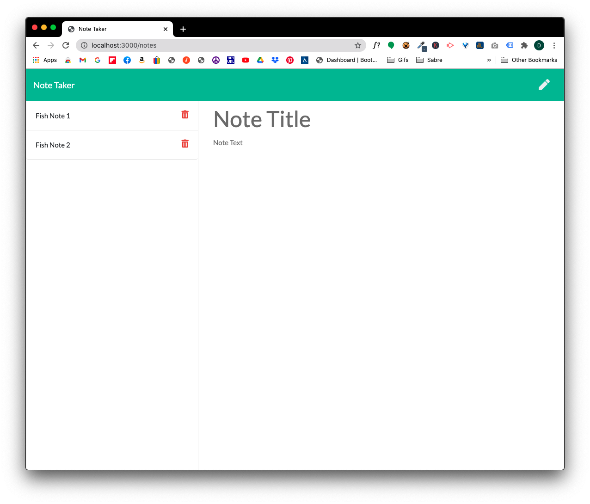

  # NoteTaker

  ## Description
  An application that can be used to write, save, and delete notes. This application will use an express backend and save and retrieve note data from a JSON file.

  ## Table of Contents

  * [Installation](#installation)
  * [Usage](#usage)
  * [Credits](#credits)
  * [Author](#author)

  ## Installation
  To be able to run this application, the user will need to run `npm install` in order to install any dependencies that are in the package.json file. In this case the 'express' package needs to be installed. Then to run the application, use `node app.js`.

  ## Usage
  Once the user installs all dependencies and runs the application with `node server.js`, they will then get a message in the console that reads 'App listening on PORT: 3000'. To view the app, open a browser and type in 'http://localhost:3000/' as the url. They are presented with the homescreen. Once they click on the 'Get Started' button, the app will then allow the user to create multiple notes and will be able to save the notes and delete them.
  See screenshot below:

  

  ## Credits
  I like to give credit to Google and my tutor Andrew Knowles https://github.com/jaknowles97.

  ## Author

  Dave Powell

  

  * [Github Profile](https://github.com/evadllewop)
  * [Project Repo](https://github.com/evadllewop/NoteTaker)

