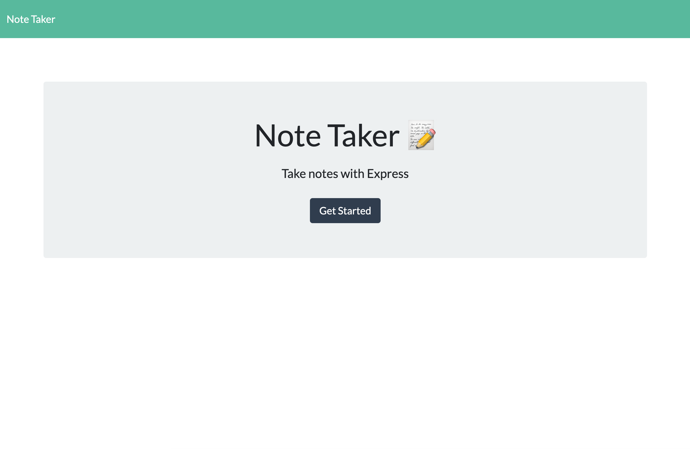

  # Note Taker


  ## Description
  An application that can be used to write, save, and delete notes. This application uses an express backend and save and retrieve note data from a JSON file.


 ## User Story

```
AS A user, I want to be able to write and save notes
I WANT to be able to delete notes I've written before
SO THAT I can organize my thoughts and keep track of tasks I need to complete
```

## Business Context

```
For users that need to keep track of a lot of information, it's easy to forget or be unable to recall something important. Being able to take persistent notes allows users to have written information available when needed.
```

## Acceptance Criteria

```
Application should allow users to create and save notes.
Application should allow users to view previously saved notes.
Application should allow users to delete previously saved notes.
```
  
  ## Table of Contents
  * [Screenshot](#screenshot)
  * [Technologies](#technologies)
  * [Project URLs](#urls)
  * [Author](#author)


  ## Screenshot
  


  ## Technologies
  * HTML
  * CSS
  * Bootstrap
  * Font Awesome
  * Javascript
  * Express
  * JSON


  ## URLs
  * Deployed App:
  https://ancient-river-00430.herokuapp.com/

  * Github Repo:
  https://github.com/evadllewop/NoteTaker
 

  ## Author
  Dave Powell

  

  * [Github Profile](https://github.com/evadllewop)


